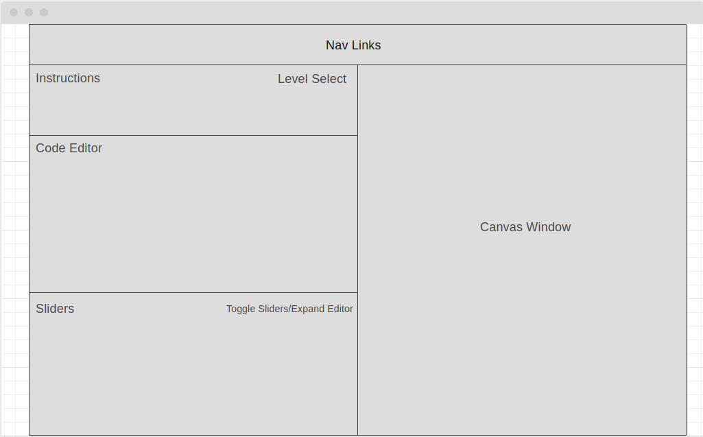

# Can I Canvas?

## Description ##
[Can I Canvas?](https://kevintungdhr.github.io/canvas-teaching-tool/) is designed for people to learn how to use the Canvas API / library as well as give users a place test out their ideas in realtime. This app contains two key features: a sandbox environment (in progress) with a built-in browser code editor that updates the canvas elements in real time as well as a tutorial for teaching basic canvas concepts. 

### Tutorial ###
Level-based tutorial that focuses on adjusting a few lines of code per level (i.e, change the context.rect(args) to place the rectangle within the goal zone). Each level will have example code as well as instructions on what the user should be trying to accomplish (i.e, move the drawn element into the box or rotate it 30 degrees). Each level will become progressively more difficult to focus on more and more advanced topics. 

### Languages and Technologies ###
  * Vanilla JavaScript
  * HTML5/CSS
  * Canvas for rendering 2D elements
  * CodeMirror Library (for code based text editor)
  * PixelMatch (for solution checking)
  * Webpack to bundle the JS modules for browser

## Layout ##

## Functionalities and MVPs ##

In **Can I Canvas?**, users will be able to:

  * Update canvas elements in realtime by writing directly in the browser
  * Play through levels of the tutorial to gain a better grasp of the Canvas API
  * Select different levels to play through
  * Code with full JavaScript functionality in the browser
  * Learn Canvas!

## Future Considerations ##
  * Sandbox mode that will:
    * Be able to interact with drawn canvas elements through UI inputs such as sliders or input boxes
    * Show updates in the written code when interacing with the UI
  * Give better feedback when the code they write is incorrect
  * Hover over elements to provide tool tips
  * Hints to problems
  * A button to toggle a solutions reveal
  * Add a perceptual hashing algorithm for compare solutions to the user input.
  * Adding intermediate, and advanced levels to show more complex Canvas concepts.
  * Having tabs in the Code Editor to show the underyling HTML and CSS of the canvas elements.
  * Animated demos to provide examples of how Canvas elements work.

## Wireframes ##

  * Nav links will link to sandbox mode, tutorial mode, this GitHub repo and my LinkedIn
  * Instructions will provide directions for each level
  * Level select will provide arrow buttons to go to previous and next levels as well as a dropdown menu to select a specific level
  * Code editor to write JavaScript that will affect the canvas 2d elements on the
  * Canvas window that will be a direct correlation to the javascript in the code editor
  * Sliders that affect the 2D elements and a toggle button to collapse the slider window and expand the code editor.
  * Code editor will also supply feedback on errors in code.

